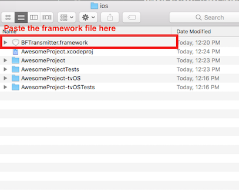
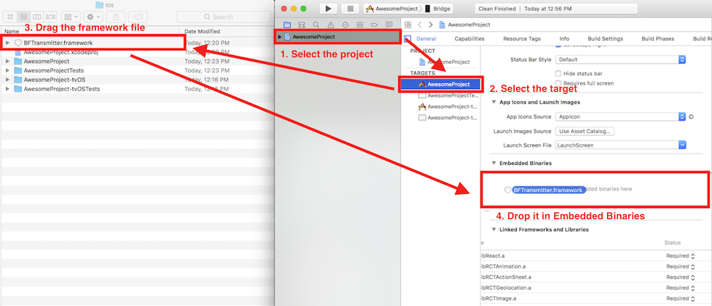
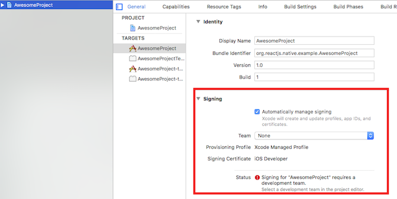
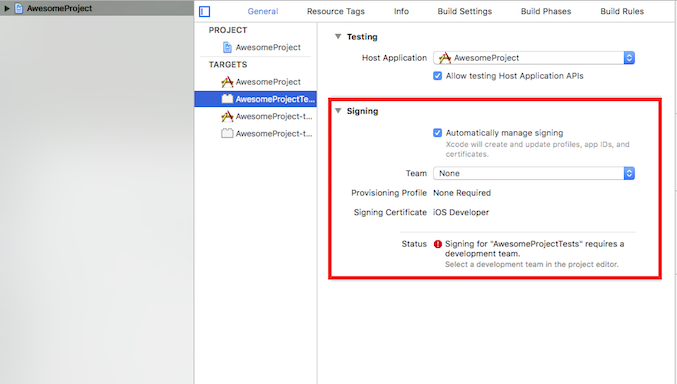

# React Native interface for Bridgefy
This repository contains a module for [React Native](https://facebook.github.io/react-native/) that is an interface to use [Bridgefy SDK](https://www.bridgefy.me/), this interface can be used for Android and iOS projects. If you want to know how to use the framework natively in android, you can find it [here](https://github.com/bridgefy/bridgefy-android-samples/blob/master/README.md), in the other hand the official iOS repository is [here](https://bitbucket.org/bridgefy/bridgefy-ios-dist).

## Install on existing project

**Note:**
This section explains how to add Bridgefy to an existing project with native code. If you don't know how to create a Native React project with native code, you can check it [here](https://facebook.github.io/react-native/docs/getting-started.html), under the tab **Building Projects with Native Code**.  

Let's suppose your project name is `AwesomeProject`, go to the root directory of the project and run the following command:

```
npm install --save git+https://git@bitbucket.org/bridgefy/react-native-bridgefy-sdk.git
```

It will download and install the bridgefy module, don't forget the parameter `--save` if you want to save the dependency in your `package.json`, so you can install/update Bridgefy easier in the future.  
At this point you already have the module, but in order to be able to use it, you will need to make some configurations for every platform.

### Android install

First, open the project in Android Studio, this is located in `AwesomeProject/android`.  
Once the project is open, you will need to indicate where the module is installed, to do this open the file  `android/settings.gradle` and add the following code:
```xml
include ':react-native-bridgefy-sdk'
project(':react-native-bridgefy-sdk').projectDir = new File(settingsDir, '../node_modules/react-native-bridgefy-sdk/android'
```
After this you will need to indicate the maven repository to download the native SDK and add the React Native interface as a dependency. To do this open the file `android/app/build.gradle` and add the followind code:

```xml
 repositories {
             maven {
                 url "http://maven.bridgefy.com/artifactory/libs-release-local"
                 artifactUrls = ["http://jcenter.bintray.com/"]
             }
 }
 dependencies {
                compile project(':react-native-bridgefy-sdk')
}
```

Open the main activity (`android/app/src/main/java/**/MainApplication.java`) and add the following segments of code:

```java
  ...
  // Import the module
  import com.bridgefy.react.sdk.BridgefySdkPackage;
  ...
  // Add this method in the MainApplication class to indicate the packages to use.
  @Override
  protected List<ReactPackage> getPackages() {
            return Arrays.<ReactPackage>asList(
                  new MainReactPackage(),
                  new BridgefySdkPackage() // add this for react-native-bridgefy-sdk
            );
          }
  ...
```

As final step, add the needed permissions by Bridgefy to work in the file `AndroidManifest.xml`:  
```java
android.permission.BLUETOOTH
android.permission.BLUETOOTH_ADMIN
android.permission.INTERNET
```
If you're targeting devices with Android  6.0 (**API Level 23**) or higher, either one of the following permissions is also required:

```java
android.permission.ACCESS_FINE_LOCATION
android.permission.ACCESS_COARSE_LOCATION
```

### iOS Install

First, go to the official [Bridgefy iOS repository](https://bitbucket.org/bridgefy/bridgefy-ios-dist) to download the last version of `BFTransmitter.framewok`.

Once you have the framework file, move to `AwesomeProject/ios` and copy there the downloaded file. Just as is indicated in the following image:  

  

Next, move to the root directory (`AwesomeProject`) and run there the following command to link the interface module to the project:

```
react-native link
```
Open the XCode project, you will need to add `BFTransmitter.framework` to "Embedded binaries", you can do this by dragging the file like is shown in the following image:  


  
Finally, select a Development team for the target `AwesomeProject` and  `AwesomeProjectTests` like is shown in the following images:  

  

  

At this point you can run the application directly from XCode using a physical device.

## Usage

### Initialization

First, make sure you have an API KEY to use the framework, if you don't have it, please go to the Bridgefy [site](https://www.bridgefy.me/) to get one. You will need to indicate the bundle id of your Android and iOS native projects.

To start to work with the framework in Javascript, you will have to import it to the `.js` file you will be working, so add the following code:

```javascript
  import Bridgefy from 'react-native-bridgefy-sdk'
  import {
      ...
      DeviceEventEmitter,
      ...
    } from 'react-native';
```  
Before any use, you will need to initialize the Bridgefy engine, you can do it with the following code, just change the text `BRIDGEFY_API_KEY` with your actual API_KEY:  

```javascript
  Bridgefy.init("BRIDGEFY_APY_KEY", 
    (errorCode, message)=>{
                console.log(errorCode + ":" + message);
                },
    (client) => {
                console.log(client);
                }
    );
```
If the initialization fails you will get an `errorCode` (Integer) and a `message` (string) that indicates the reason of the failute. If the initialization is successful you will get a `client` dictionary, that is described in the Appendix section.  

### Start and stop the service

To keep resources, you will need to start the transmitter before use it, this is the code to do it:
```javascript
BridgefySDK.start();
```
Once you finished using the service you can stop it by using the following code:
```javascript
BridgefySDK.stop();
```

### Sending messages

You can send a message to an specific user, you need the identifier for that user (we will explain in the next section how to obtain it), this message will be tried to be delivered even if the receiver user is not connected right now (using our mesh algorithm). An example of how to send a direct message is the following:

```javascript
  var message = {
                 content:{ 
                          message: "Hello world!!",
                          language: "English"
                 },
                 receiver_id: "A_STRING_USER_IDENTIFIER",
               };
 Bridgefy.sendMessage(message);
```
You create a dictionary with the fields `content` and `receiver_id`. `content` can contain whatever you want, even another dictionary, as long the data types you use comply with the ones supported by JSON format. `receiver_id` is the identifier for the receiver user.  

You can also send a broadcast message, a broadcast message is a message that will be delivered to all nearby users, not to an specific user. As direct messages do, it will be sent even to no connected users using the mesh algorithm. Example:

```javascript
  var message = {
                 content:{ // Custom content
                          message:"Hello world!!"
                 }
                };
 Bridgefy.sendBroadcastMessage(message);
```
The dictionary just contains the field `content`, whose structure was explained before. Also note that the method invoked is `sendBroadcastMessage`.

### Listeners

You will need to implement some listeners in order to receive messages, detect nearby users and get their user identifier, failures, etc. The following code is an example about how you can do it, every listener has a comment explaining what is its purpose:

```javascript

    //
    // Message listeners
    //   

    // This event is launched when a message has been received, 
    // the `message` dictionary structure is explained in the appendix
    DeviceEventEmitter.addListener('onMessageReceived', (message)=> {
                        console.log('onMessageReceived: '+ JSON.stringify(message));
                      }
    );

    // This event is launched when a broadcast message has been received, the structure 
    // of the dictionary received is explained in the appendix.
    DeviceEventEmitter.addListener('onBroadcastMessageReceived', (message)=> {
                        console.log('onMessageReceived: '+ JSON.stringify(message));
                      }
    );

    // This event is launched when a message could not be sent, it receives an error
    // whose structure will be explained in the appendix
    DeviceEventEmitter.addListener('onMessageFailed', (error)=> {
                        console.log('onMessageFailed: '+ error);

                        console.log('code: ' + error.conde); // error code
                        console.log('message' + error.message); // message object
                        console.log('description' + error.description); // Error cause 

                      }
    );

    // This event is launched when a message was sent, contains the message
    // itself, and the structure of message is explained in the appendix.
    DeviceEventEmitter.addListener('onMessageSent', (message)=> {
                        console.log('onMessageSent: '+ JSON.stringify(message));
                      }
    );

    // This event is launched when a message was received but it contains errors, 
    // the structure for this kind of error is explained in the appendix.
    // This method is launched exclusively on Android.
    DeviceEventEmitter.addListener('onMessageReceivedException', (error)=> {
      
                        console.log('onMessageReceivedException: '+ error);
                        console.log('sender: ' + error.sender); // User ID of the sender
                        console.log('code: ' + error.code); // error code
                        console.log('message' + error.message); // message object empty
                        console.log('description' + error.description); // Error cause 

                      }
    );

    //
    // Device listeners
    //   

    // This event is launched when the service has been started successfully, it receives
    // a device dictionary that will be descripted in the appendix.
    DeviceEventEmitter.addListener('onStarted', (device)=> {
                        // For now, device is an empty dictionary
                      }
    );

    // This event is launched when the Bridgefy service fails on the start, it receives
    // a dictionary (error) that will be explained in the appendix.
    DeviceEventEmitter.addListener('onStartError', (error)=> {
                        console.log('onStartError: '+ error);
                        console.log('code: ' + error.conde); // error code
                        console.log('description' + error.description); // Error cause 
                      }
    );

    // This event is launched when the Bridgefy service stops.
    DeviceEventEmitter.addListener('onStopped', ()=> {
                        console.log('onStopped');
                      }
    );

    // This method is launched when a device is nearby and has established connection with the local user.
    // It receives a device dictionary.
    DeviceEventEmitter.addListener('onDeviceConnected', (device)=> {
                        BridgefyClient.deviceList.push(device);
                        console.log('onDeviceConnected: ' + device.DeviceName + " size: " + BridgefyClient.deviceList.length);
                    }
    );
    // This method is launched when there is a disconnection of a user.
    DeviceEventEmitter.addListener('onDeviceLost', (device)=> {
                        console.log('onDeviceLost: ' + device);
                      }
    );

    // This is method is launched exclusively on iOS devices, notifies about certain actions like when
    // the bluetooth interface  needs to be activated, when internet is needed and others.
    DeviceEventEmitter.addListener('onEventOccurred', (event)=> {
                        console.log('Event code: ' + event.code + ' Description: ' + event.description);
                      }
    );
```

## Appendix

This section explain the structure of the dictionaries used before:

### client
```javascript
{
    api_key: 'YOUR_API_KEY',
    bundle_id: 'your.bundle.id',
    public_key: 'STRING_WITH_PUBLIC_KEY',
    secret_key: 'STRING_WITH_SECRET_KEY',
    userUuid: 'LOCAL_USER_IDENTIFIER',
    deviceProfile: 'DEVICE_PROFILE'

}
```
**api_key:** The API KEY that was used to initialize the framework. It will be empty on iOS.  
**bundle_id:** The package id of the application. It will be empty on iOS.  
**public_key:** The string representation of the local public key used to encrypt content.  
**secret_key:** The string representation of the local secret key used to encrypt content. It will be empty on iOS.  
**userUuid:** The string identifier of the local user.  
**deviceProfile:** The profile used to initialize the service (string). It will be empty on iOS.  


### message
```javascript
{
    receiverId: 'RECEIVER_USER_IDENTIFIER',
    senderId: 'SENDER_USER_IDENTIFIER',
    uuid: 'IDENTIFIER_OF_THE_MESSAGE',
    dateSent: UNIX_TIME,
    content: {},

}
```
**receiverId:** String identifier of the receiver user. Will be empty if it's a broadcast messge.  
**senderId:** String identifier of the sender user.  
**uuid:** String identifier of the message.  
**dateSent:** Integer with the date in unix format. Will be invalid on iOS.  
**content:** The content of the message (a dictionary).  

### error
```javascript
{
    code: INTEGER_ERROR_CODE,
    description: 'DESCRIPTION_OF_ERROR',
    origin: message,
}
```
**code:** Code of the error (integer). The code may differ between iOS and Android.  
**description:** String description of the error.  
**origin:** `message` dictionary related to the error. If it doesn't apply it will be an empty string or won't be included.  

### error (onMessageReceivedException)
```javascript
{
    code: INTEGER_ERROR_CODE,
    description: 'DESCRIPTION_OF_ERROR',
    sender: 'SENDER_USER_IDENTIFIER',
    message: {},
}
```
**code:** Code of the error (integer). The code may differ between iOS and Android.
**description:** String description of the error.  
**sender:** String identifier of the sender user.  
**message:** Message received with failure.  

### device
```javascript
{
    userId: 'USER_IDENTIFIER',
    deviceAddress: 'BLUETOOTH_DEVICE_ADDRESS',
    deviceName: 'BLUETOOTH_DEVICE_NAME',
    sessionId: 'BRIDGEFY_SESSION_ID',
    deviceType: 'ANTENNA_DEVICE_AVAILABLE',
    crc: CRC_OF_USER_IDENTIFIER,
    retries: CONNECTION_ATTEMPS,
}
```
**userId:** String identifier of the receiver user.  
**deviceAddress:** String device address for the antenna BLUETOOTH or BLUETOOTH_LE.  
**deviceName:** String device name of bluetooth device.  
**sessionId:** String internal session identifier of bridgefy sdk.  
**deviceType:** String Antenna name of connectivity (BLUETOOTH, BLUETOOTH_LE).  
**crc:** Long CRC32 of user identifier.  
**retries:** Integer connection attempts before success.  

## Bridgefy SDK Events
These are the event codes that can be presented in the listener `onEventOccurred`:

### iOS Events  
**BFEventStartWaiting(value 0)**:Waiting for online validation to start the transmitter.  
**BFEventStartFinished(value 1)**:The transmitter was started.  
**BFEventInternetNeeded(value 2)**:The transmitter needs internet to validate license.  
**BFEventAlreadyStarted(value 3)**:The transmitter was already started.  
**BFEventOnlineWarning(value 4)**:Something was detected in backend validation, but if the license is valid, this doesn't stop the transmitter.  
**BFEventOnlineError(value 5)**:An error was detected in backend validation and service must be stopped.  
**BFEventNearbyPeerDetected(value 6)**:Indicates if a near peer was detected, this event is only invoked if the app is in background mode and this mode is enabled in the BFTransmitter instance.  
**BFEventBluetoothDisabled(value 7)**:Indicates that the bluetooth interface was disabled or the app doesn't have permissions.  
**BFEventWifiDisabled(value 8)**:Indicates that the Wi-fi interface was disabled or the app doesn't have permissions.
### Android Events
**BFEventStartWaiting(value 0)**:Waiting for online validation to start the Bridgefy SDK.  
**BFEventStartFinished(value 1)**:The Bridgefy was started.  
**BFEventNearbyPeerDetected(value 6)**:Indicates if a near peer was detected.
